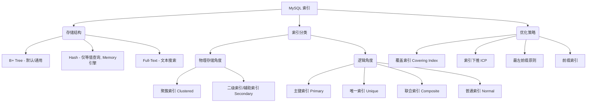

# 📚 MySQL 索引体系专题复习

## 🗺️ 核心知识地图


---

## 💡 核心考点速记

### 1. 为什么选择 B+ 树？
- **磁盘 IO 友好**：B+ 树更"矮胖"，层级低（通常 3-4 层可支撑千万级数据），减少磁盘寻道次数。
- **范围查询强**：叶子节点双向链表连接，适合 `BETWEEN`, `>`, `<` 等操作。
- **查询效率稳定**：所有数据都在叶子节点，任何查找都要走到底。
- **对比**：
    - **B 树**：非叶子节点存数据，导致单页存储指针减少，树增高；不方便范围查询。
    - **红黑树**：数据量大时，树深太高。
    - **Hash**：不支持范围查询，会有哈希冲突。

### 2. 聚簇索引 vs 二级索引
| 特性 | 聚簇索引 (Clustered) | 二级索引 (Secondary) |
|---|---|---|
| **叶子节点存储** | 完整行记录 | 索引列 + 主键值 |
| **数量** | 每张表只能有一个 | 可以有多个 |
| **回表** | 无需回表 | 查非索引列时需回表 |

### 3.索引失效 "避坑指南"
- **函数/表达式**：`WHERE AGE + 1 = 10` (❌) -> `WHERE AGE = 9` (✅)
- **隐式类型转换**：字符串不加引号 `WHERE phone = 138...` (❌)
- **最左前缀法则**：联合索引 `(a, b, c)`，查 `b, c` 或 `c` 不走索引。
- **左模糊查询**：`LIKE '%abc'` (❌)，`LIKE 'abc%'` (✅)
- **OR 条件**：若 OR 左右有列没索引，则全表扫描。

---

## 🎯 必刷高频真题 (Top 10)

1. **[Q_640abf]** 聚簇索引与非聚簇索引的区别? 为什么 InnoDB 选择 B+ 树?
2. **[Q_c3e395]** 索引底层数据结构，三层高的 B+ 树能存多少数据？
3. **[Q_a03ddc]** 在哪些场景下 MySQL 索引会失效？请解释最左前缀匹配原则的底层逻辑。
4. **[Q_63164a]** 什么是“回表”查询？如何通过联合索引（索引覆盖）避免回表？
5. **[Q_93f66f]** 为什么单表达到 2000 万就有查询性能问题？
6. **[Q_d653f8]** B+ 树最底层是双向链表有什么好处？
7. **[Q_56adbb]** 联合索引查询时的 B+ 树与单索引查询时的 B+ 树有什么区别？
8. **[Q_aa9499]** 什么是索引下推 (ICP)？它在什么阶段减少了回表次数？
9. **[Q_de42d4]** 高并发场景下，如何根据 name 字段查询 id？请给出优化方案。
10. **[Q_c2edf6]** 对索引做计算或使用函数会导致失效，如何理解？

---

## 🛠️ 实战练习
尝试使用以下命令查看上述题目的详细解析（如果系统支持）：
```bash
# 示例：查看第一题
node scripts/query_tagged.js question --id "640abf6ebfb0239eb89a462d2459ebf5"
```
