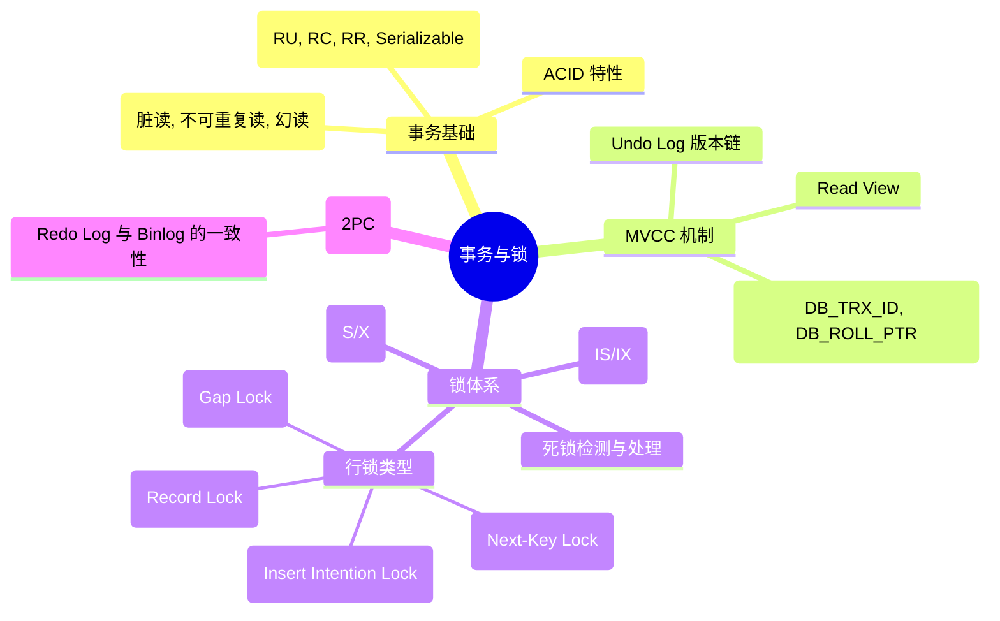

# 📋 MySQL 复习：事务与锁机制 (Transactions & Locks)

## 🗺️ 知识大地图

---

## 💡 核心知识点卡片

### 1. MVCC 实现原理 (面试必考)
*   **本质**：通过“版本链”和“Read View”实现非阻塞的快照读。
*   **Read View 四个关键字段**：
    *   `m_ids`: 活跃事务 ID 列表。
    *   `min_trx_id`: 最小活跃事务 ID。
    *   `max_trx_id`: 下一个应分配的事务 ID。
    *   `creator_trx_id`: 创建该视图的事务 ID。
*   **判断逻辑**：三段式判断（已提交、未提交、自身事务）。

### 2. 线锁类型区分
| 锁名称 | 作用范围 | 解决的核心问题 |
| --- | --- | --- |
| **Record Lock** | 单个行记录 | 保证并发修改安全 |
| **Gap Lock** | 索引项之间的间隙 | 防止幻读（禁止插入） |
| **Next-Key Lock** | 记录 + 间隙 (左开右闭) | InnoDB RR 级别的默认行锁 |

---

## 🏆 本模块高频 Top 10 (题目 ID)

1. `b43bb9` - MVCC 机制原理详解
2. `b4868f` - InnoDB 如何解决幻读？
3. `16b91d` - RC 与 RR 级别下 ReadView 生成时机对比
4. `b3f51e` - RR 级别下的锁协作机制
5. `6eeba0` - 实时读 vs 快照读
6. `fbceac` - MVCC 组件协作流程
7. `81251a` - 可重复读的具体实现
8. `fae39a` - MVCC 与 2PC 的关系
9. `c874e7` - ACID 的物理底层支撑
10. `8075f1` - 行级锁类型全解
